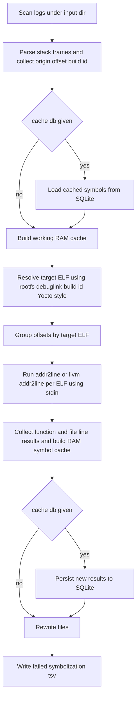
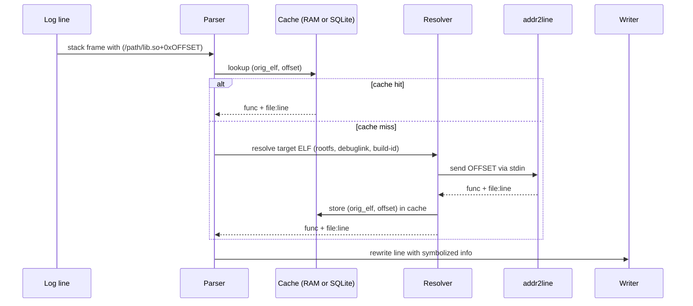

# QMS (Quick Multi Symbolizer)

`quick_multi_symbolizer.py` is a fast, parallel ASan/Crash log symbolizer for ELF binaries.

It parses stack traces that contain entries like:

```text
#1 0x1ffff9de0d58 (/usr/share/multiassistant/engines/wakeup-engine-default/libwakeup-engine.so+0x1fdb8) (Build-id:aa0d6e026a2f250d0d66c27c4c0fe9f97c39df3)
```

and rewrites them into a more readable form using `addr2line` / `llvm-addr2line`:

```text
(/usr/share/.../libwakeup-engine.so+0x1fdb8 -> wakeup_engine::Initialize src/wakeup_engine.cc:123)
```

---

## Overview

- **ASan / Crash log symbolization**
  - Parses patterns of the form `(/path/lib.so+0x1234)` and nearby `(Build-id:xxxx)` markers, then converts them into actual source code locations.

- **Two symbolization modes: LLVM / GNU**
  - `-llvm` : use `llvm-addr2line` (default)
  - `-gnu`  : use GNU `addr2line` with build-id and `.gnu_debuglink` based debug file lookup (Tizen and general Linux layouts)

- **rootfs prefix support**
  - Log paths might look like `/usr/lib/...`, but the real files can be inside a mounted rootfs.
  - With `--rootfs /mnt/tizen-rootfs`, the script resolves paths as `rootfs + path`, e.g. `/mnt/tizen-rootfs/usr/lib/...`.

- **Parallelization**
  - ELF-level symbolization: `ProcessPoolExecutor`
  - File rewriting: `ThreadPoolExecutor`
  - Each can be tuned independently:
    - `--workers-symbol N`
    - `--workers-rewrite M`
  - Auto modes:
    - `--workers-symbol auto` → auto = min(CPU_count, AvailableRAM / 300MB)
    - `--workers-rewrite auto` → auto = max(4, CPU_count)

- **GNU cross toolchain support**
  - With `-gnu -c arm-linux-gnueabihf-`, the script uses:
    - `arm-linux-gnueabihf-addr2line`
    - `arm-linux-gnueabihf-readelf`
  - This allows symbolizing binaries built for a different architecture (cross environment).

  - In GNU mode, when resolving the debug ELF to use, the following priority is applied:
    1. `.gnu_debuglink` section:
       - `<dir(orig_elf)>/<debuglink_name>`
       - `<dir(orig_elf)>/.debug/<debuglink_name>`
    2. build-id based (debug_root is interpreted inside the given rootfs):
       - `<debug_root>/<first2>/<rest>.debug`
       - `<debug_root>/<first2>/<rest>`
    3. Yocto-style (only when `debug_root` points under something like `/usr/lib/debug/.build-id`):
       - `/usr/lib/debug/<full-path>.debug`
    4. If nothing is found, fall back to the original ELF: `rootfs + orig_elf`.

- **Delta symbolization (SQLite cache, optional)**
  - When `--cache-db symbol_cache.sqlite` is enabled:
    - The mapping `(orig_elf, offset) -> (func, loc)` is stored in SQLite.
    - On subsequent runs, already-seen pairs are not sent to `addr2line` again.
  - If you do not use this option, SQLite is not used at all and the script behaves exactly like the non-cached version.

- **Demangling option**
  - With `-d` / `--demangle`, C++ symbol names are demangled into a human-readable form.
  - Internally this passes `-C` to `addr2line`.

- **Failure logging**
  - All symbolization failures are collected into `failed_symbolization.tsv`.
  - Each line contains:
    - `orig_elf`, `offset`, `build_id`, `resolved_target_elf`, `reason`.

- **Benchmark mode**
  - With `--benchmark`, QMS prints timing information for each major phase:
    - origin scan
    - cache load
    - ELF job construction
    - symbolization
    - cache save
    - file rewrite
    - total execution time
  - Benchmark mode is disabled by default and has negligible overhead when enabled.

---
## Flowchart


## Symbolization sequence (per address)

---

## Requirements

- Python 3.8+
- The following binaries must be available in your `PATH`:
  - LLVM mode: `llvm-addr2line`
  - GNU mode: `addr2line`
  - `.gnu_debuglink` parsing: `readelf` (or cross-prefixed `<prefix>readelf`)
- SQLite:
  - Uses Python’s standard `sqlite3` module; no extra installation required.
  - If `--cache-db` is not used, SQLite is not touched.

---

## Installation

You can run the script directly. For example:

```bash
git clone https://github.com/juitem/qms
cd quick_symbolizer
python3 quick_multi_symbolizer.py -h
```

---

## Input log format

The script looks for stack frames like:

```text
#1 0x1ffff9de0d58 (/usr/share/multiassistant/engines/wakeup-engine-default/libwakeup-engine.so+0x1fdb8) (Build-id:aa0d6e026a2f250d0d66c27c4c0fe9f97c39df3)
#2 0x1ffff9de0d8ac (/usr/share/multiassistant/engines/wakeup-engine-default/libwakeup-engine.so+0x168ac) (Build-id:aa0d6e026a2f250d0d66c27c4c0fe9f97c39df3)
#3 0x1ffff9de02194 (/usr/share/multiassistant/engines/wakeup-engine-default/libwakeup-engine.so+0x12194) (Build-id:aa0d6e026a2f250d0d66c27c4c0fe9f97c39df3)
```

The important patterns are:

- `(/absolute/path/to/lib.so+0xOFFSET)`
- Nearby `(Build-id:HEX...)` or `(buildid: HEX...)`.

The script reads the entire file and:

1. Collects all `(orig_elf, offset)` candidates from `(/path+0xoffset)`.
2. Associates each candidate with the closest matching build-id in the same text region.

---

## How it works

In short, the pipeline works as follows:

1. **Collect origins**
   - Walks all files under `--input-dir`.
   - For each file:
     - Finds all `(/path+0xoffset)` patterns and builds the set `(orig_elf, offset)`.
     - Finds all `(Build-id:xxxx)` markers and associates the nearest one with each occurrence.

2. **Delta cache (optional)**
   - If `--cache-db` is provided:
     - Loads the cache from SQLite using `(orig_elf, offset)` as key.
     - Entries that already exist in the cache are **excluded from symbolization**.
     - Only the remaining new addresses go to `addr2line`.

3. **Resolve target ELF**
   - For each `(orig_elf, offset, build_id)`, resolve which actual ELF (`target_elf`) should be symbolized.
   - In GNU mode, the priority is:
     1. `.gnu_debuglink`-based candidates
     2. build-id directory (`--debug-root`)
     3. `/usr/lib/debug/<full-path>.debug`
     4. Fallback to `rootfs + orig_elf`
   - In LLVM mode:
     - Uses only `rootfs + orig_elf`.
     - Further debug-file lookup is delegated to `llvm-addr2line`.

4. **Parallel symbolization (ELF-level)**
   - Many offsets can belong to the same ELF.
   - The script groups offsets by ELF and, for each group:
     - Spawns a single `Addr2LineProcess` instance.
     - Sends all offsets via stdin to that process.
   - Uses `ProcessPoolExecutor` with `--workers-symbol` to process multiple ELFs in parallel.

5. **In-memory symbol cache**
   - Builds an in-memory cache: `(orig_elf, offset) -> (func, loc)`.
   - If `--cache-db` is enabled, this new cache is also persisted to SQLite.

6. **Parallel file rewrite**
   - For every file found under `--input-dir`:
     - Writes the transformed version under `--output-dir`, preserving relative paths.
     - In the file content, replaces every `(/path+0xoffset)` with:
       - `(/path+0xoffset -> func file:line)` if the symbol info exists.
       - Leaves it unchanged if there is no symbol data.
   - This step uses `ThreadPoolExecutor` and `--workers-rewrite` for parallelism.

7. **Failure report**
   - For failed symbolizations:
     - Missing ELF files
     - `addr2line` returning no result
   - All such failures are collected into `failed_symbolization.tsv`.

---

## Usage examples

### 1. LLVM mode (default)

```bash
python quick_multi_symbolizer.py \
  --input-dir ./logs_raw \
  --output-dir ./logs_sym \
  --rootfs /mnt/tizen-rootfs \
  -llvm \
  --workers-symbol 8 \
  --workers-rewrite 32 \
  -d
```

- `-llvm` : use `llvm-addr2line`
- `--rootfs` : maps `/usr/...` in logs to `/mnt/tizen-rootfs/usr/...`
- `-d` : enable C++ demangling

### 2. GNU mode + Tizen build-id + ARM cross toolchain

```bash
python quick_multi_symbolizer.py \
  --input-dir ./logs_raw \
  --output-dir ./logs_sym \
  --rootfs /mnt/tizen-rootfs \
  -gnu \
  --debug-root /usr/lib/debug/.build-id \
  -c arm-linux-gnueabihf- \
  --workers-symbol 8 \
  --workers-rewrite 32 \
  --cache-db ./symbol_cache.sqlite \
  -d
```

- `-gnu` : GNU addr2line mode
- `--debug-root` : base directory for build-id debug files
  (if omitted, the tool assumes a `.build-id` directory under the given rootfs).
- `-c arm-linux-gnueabihf-` :
  - Uses `arm-linux-gnueabihf-addr2line`
  - Uses `arm-linux-gnueabihf-readelf`
- `--cache-db` : enable delta symbolization
- `-d` : enable C++ demangling

### 3. One-shot symbolization without cache

```bash
python quick_multi_symbolizer.py \
  --input-dir ./logs_raw \
  --output-dir ./logs_sym \
  --rootfs /mnt/tizen-rootfs \
  -gnu
```

- Without `--cache-db`, SQLite is never used.
- Every run symbolizes all addresses from scratch.
- Without `--debug-root`, build-id debug files are looked up under `<rootfs>/.build-id` by default.

### 4. Auto parallelism example

```bash
python quick_multi_symbolizer.py \
  --input-dir ./logs_raw \
  --output-dir ./logs_sym \
  --rootfs /mnt/tizen-rootfs \
  --workers-symbol auto \
  --workers-rewrite auto
```

### 5. Benchmark mode

```bash
python quick_multi_symbolizer.py \
  --input-dir ./logs_raw \
  --output-dir ./logs_sym \
  --rootfs /mnt/tizen-rootfs \
  --benchmark
```

Example output:

```
[BENCH] collect_origins: 0.123s
[BENCH] load_cache_from_db: 0.015s
[BENCH] build_jobs_by_target: 0.041s
[BENCH] symbolize_all_parallel: 0.812s
[BENCH] build_symbol_cache: 0.009s
[BENCH] rewrite_files: 0.067s
[BENCH] save_failures: 0.002s
[BENCH] total_time: 1.119s
```

---

## Command-line options

| Option | Type | Default | Description |
|---------------------------|------|---------|-------------|
| `--input-dir` | path | (required) | Root directory of raw log files to read. |
| `--output-dir` | path | (required) | Output directory to store symbolized logs. |
| `--addr2line` | path | auto | Explicit addr2line binary. If not set, uses `llvm-addr2line` for `-llvm`, or `[cross-prefix]addr2line` for `-gnu`. |
| `--debug-root` | path | empty (=> `.build-id` under rootfs) | Base directory for build-id debug files (GNU mode only). If empty, the tool assumes a `.build-id` directory located under the given rootfs and resolves build-id paths relative to it. |
| `--rootfs` | path | empty | Rootfs prefix for resolving ELF paths from logs. |
| `--workers-symbol` | int/auto | 1 | Symbolization workers. `"auto"` or `0` → auto = min(CPU_count, AvailableRAM / 300MB); `1` → no parallelism; `N>1` → use N workers. |
| `--workers-rewrite` | int/auto | 1 | File rewrite workers. `"auto"` or `0` → auto = max(4, CPU_count); `1` → no parallelism; `N>1` → use N workers. |
| `-c, --cross-prefix` | string | empty | Cross prefix for GNU toolchain, e.g. `arm-linux-gnueabihf-`. |
| `--cache-db` | path | empty | SQLite DB path for delta symbolization. If empty, persistent cache is disabled. |
| `-d, --demangle` | flag | off | Enable C++ name demangling (`-C` flag to addr2line). |
| `--benchmark` | flag | off | Print timing information for each major pipeline phase. |
| `-gnu` | flag | off | Use GNU addr2line mode. |
| `-llvm` | flag | default | Use llvm-addr2line mode (default). |

---

## Internals

- **Regex-based parser**
  - `STACK_ENTRY_PATTERN` finds `(/path+0xoffset)` patterns.
  - `BUILD_ID_PATTERN` finds `(Build-id:xxxx)` markers.

- **ELF-level symbolization**
  - For multiple offsets in the same ELF, only one addr2line process is spawned and all addresses are streamed to it via stdin, significantly reducing process creation overhead.

- **Batch addr2line via stdin (multi-address streaming)**
  - For each ELF, the script launches only **one** `addr2line`/`llvm-addr2line` process.
  - All offsets belonging to that ELF are streamed through **stdin**, one per line, instead of being passed as command-line arguments.
  - This avoids OS-level argument length limits (ARG_MAX) and keeps process creation overhead very low.
  - If any single offset fails to resolve, `addr2line` returns `??` for that entry but continues processing the remaining offsets without terminating.
  - This makes symbolization efficient and robust even when a single ELF has tens of thousands of addresses.

- **Delta cache**
  - SQLite table schema:
    - `symbols(orig_elf TEXT, offset TEXT, func TEXT, loc TEXT, PRIMARY KEY(orig_elf, offset))`
  - The cache key is `(orig_elf, offset)` where `orig_elf` is the path from the log.

---

## Limitations / Future work

- `.gnu_debuglink` parsing currently depends on the `readelf` command.
- DWARF parsing is delegated to addr2line/llvm-addr2line rather than implemented in Python.
- Possible future extensions:
  - `pyelftools`-based `.gnu_debuglink` parsing to remove the `readelf` dependency.
  - Additional log formats (other sanitizers, custom crash reporters).
  - Customizable output formats (JSON, CSV, etc.).

---